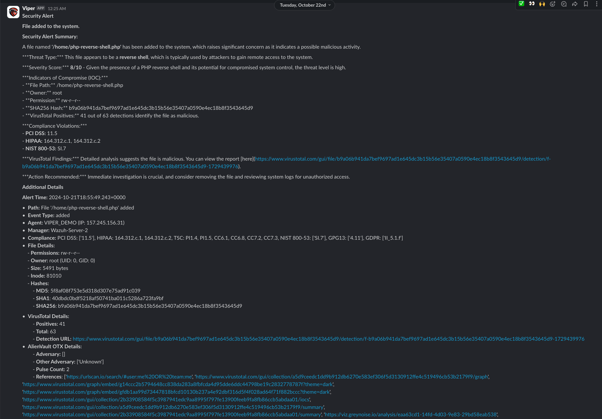

# Viper
VIPER is a specialized alert enrichment and summarization system designed for seamless integration with **Wazuh Unified XDR and SIEM** [[1](https://wazuh.com/)]. It leverages external threat intelligence sources, such as VirusTotal and AlienVault OTX, to provide enriched alerts with critical contextual information. Powered by AI-driven Large Language Models (LLMs) (ChatGPT), VIPER aims to generates concise summaries to enhance threat understanding and prioritize responses. By delivering enriched alerts in real-time through platforms like Slack, VIPER empowers security teams to reduce response times, minimize alert fatigue, and strengthen their overall cybersecurity posture.


## ✅ Current Implementation 
- Current version of VIPER has been tested on Wazuh 4.9. 

- Currently VIPER only supports **VirusTotal** [[2](https://www.virustotal.com)] and **AlienVault OTX** [[3](https://otx.alienvault.com/)] as external data sources for alert enrichment.

- VIPER currently only supports Slack [[4](https://slack.com)] for sending enriched alerts.

## ❗❗Limitations ❗❗
- VIPER currently **can only** process **FIM** events (Wazuh Rule 550, 553 & 554), compatibility with other types of events are in the works.


## ⚙️ Setup 
VIPER uses custom server side active response [[5](https://documentation.wazuh.com/current/user-manual/reference/ossec-conf/active-response.html)] actions to get alert data from an Wazuh alert.

1. Setup Active response action in the Wazuh Server. In the `ossec.conf` file located at `/var/ossec/etc/ossec.conf` in the Wazuh manager add the following.
```xml
<!-- VIPER -->
<command>
    <name>viper</name>
    <executable>viper.py</executable>
    <timeout_allowed>yes</timeout_allowed>
</command>

<active-response>
    <disabled>no</disabled>
    <command>viper</command>
    <location>server</location>
    <rules_id>550, 553, 554</rules_id>
    <timeout>60</timeout>
</active-response>
```

2. Enable file event monitoring in realtime. Add this to either a Wazuh group to monitor or to `/var/ossec/etc/ossec.conf` 
```xml
<syscheck>
    <directories realtime="yes">{DIRECTORY_TO_MONITOR}</directories> 
</syscheck>
```

3. 🔐 Add API keys to Script. 
> NOTE: VIPER can run without the using any API, running without API results in the respective functionaly not working.

VIPER is fuly compatible with VirusTotal and AlienVault OTX free APIs.
You can find related documentation to get the nessary API keys below,

VirusTotal - [[API](https://docs.virustotal.com/docs/please-give-me-an-api-key)]

AlienVault OTX - [[API](https://otx.alienvault.com/api)] (Login required to view documentation)

Slack Webhook - [[WebHook](https://api.slack.com/messaging/webhooks)]

ChatGPT - [[Openai](https://help.openai.com/en/articles/4936850-where-do-i-find-my-openai-api-key)] (Paid API, no free version) 💰

Download and modify `viper.py` and modify the following variables with the correct keys,

`VT_API_KEY` - VirusTotal API key

`OTX_API_KEY` - AlienVault OTX API Key

`OPEN_AI_KEY` - ChatGPT API Key

`SLACK_WEBHOOK_URL` - Slack Webhook

>NOTE: If you don't want to use an API leave the default value

4. Place the modified `viper.py` in the Wazuh Server at `/var/ossec/active-response/bin` 

5. Give nessary permissions
```sh
sudo chmod 750 /var/ossec/active-response/bin/viper.py
sudo chown root:wazuh /var/ossec/active-response/bin/viper.py
```

6. Restart Wazuh Server
```sh
sudo systemctl restart wazuh-manager
```

7. Create log file
```sh
sudo touch /var/ossec/logs/viper.log
```

## 💡 Example Summarised & Enriched Slack Alert 


## 📝 In the Works
- Integration with AubseIPDB [[6](https://www.abuseipdb.com/)]
- Integration with GreyNoise [[7](https://www.greynoise.io/)]


<br>

---

<br>


## 🤝 Help Wanted
I will continue to improve VIPER as time allows me to, help from the community would be greatly appricated. Specialy with integrating new alert types and testing.